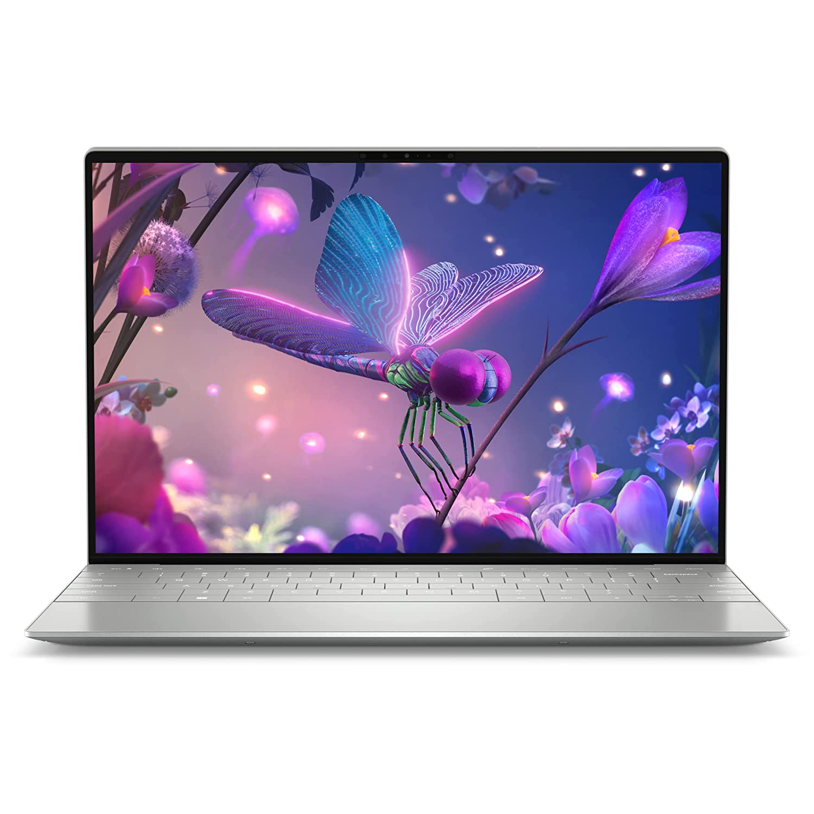

## Alder Lake Processors For Laptops

In this article, I will review the new **Alder Lake** processors in laptops. This new generation of processors is one of the best processors available for laptops, but it comes with some drawbacks. These drawbacks include higher power consumption and decreased performance. Fortunately, most of the new 12th-generation Intel laptops will perform better when plugged into a socket.

### Alder Lake processors

After the release of its high-end desktops and mobile workstations, Intel has now released processors based on the Alder Lake architecture for laptops. The company's current lineup includes high-end parts, starting with the **Core i9-12900HK**, which packs up to **14 physical cores** and **20 threads**. However, the company will also release lower-powered parts in the future.

Intel's latest laptop chips are aimed at scalability and efficiency. The Alder Lake architecture allows for a flexible portfolio of mobile CPUs with varying power requirements. For instance, the 45W H-series pairs well with discrete GPUs, while the 15W U-series packs up to 10 cores. The 14-core P-series, meanwhile, is designed for high performance in a small package.

The Alder Lake processors will be exceptionally well-suited for notebooks. Intel says it has already received over 100 design submissions from hardware partners. The processor will be available later this year. Laptops with lower-powered Alder Lake chips will be more affordable than laptops with high-end processors.

Alder Lake processors are capable of delivering class-leading performance. They feature a hybrid architecture that combines E-cores and P-cores for optimal performance. The Intel Thread Director helps the processor decide when and how to use the cores for maximum efficiency.

### Performance boosts

There are a few essential performances boosts for the new i5 laptop processors. First, the 12th-gen CPUs offer impressive multi-core performance. In Cinebench R20 and R23, they lead the previous-generation CPUs by 21.6 percent and 23%, respectively. Moreover, they are faster than their predecessors on single-threaded workloads.

The new processors have been designed with a hybrid design that is similar to that of desktop models. They combine high-performance P-cores with power-efficient E-cores. As a result, they offer a great mix of efficiency and performance. The new i5 laptop processors are available with up to eight P-cores and four E-cores. They are also able to support DDR5 memory, as well as newer USB and Thunderbolt technology.

The i5 laptop CPUs have been designed to run Windows 11 (or later) and are also capable of overclocking. However, you will need a Z690 motherboard to get the best performance from these processors. You will also need to have a high-end graphics card.

As a result of the 12th Gen processors' innovative hybrid architecture, you can expect substantial boosts in single-threaded performance and an even more significant jump in multithreaded performance. Moreover, Intel's newest chips include E-cores, which are smaller cores designed to increase performance per watt. They're also more capable of handling small tasks, such as discord or antivirus software. And because of Intel's Intel Thread Director, these processors are even better than their predecessors - it predicts workloads and intelligently assigns tasks to the appropriate core.

### Power consumption

Intel's i5 CPUs are an excellent choice for midrange laptops. They can handle both day-to-day tasks and intensive gaming. The latest i5 chips have up to 10-cores on desktops and 12-cores on mobiles, with boost clock speeds up to 5GHz.

Despite the high power consumption, they are great for long-term battery life. They can last up to 14 hours in battery mode. A typical laptop with an i5 12th generation processor is designed for a minimum of nine hours. Power consumption on a laptop with this processor will vary from model to model.

The new 12th generation of Intel Core processors is a step up from their predecessors. However, they are still quite power-hungry, especially in comparison with AMD Ryzen processors. Their architecture combines clusters of small efficiency cores with big performance cores. This allows them to excel in a wide range of workloads, including video encoding.

In terms of performance, the Intel Core i9-12900HK sits at the top of Intel's high-performance laptop chip lineup. It includes six P-cores and eight E-cores, and a total of twenty threads. In addition, the chip has a peak Turbo Boost clock speed of five GHz for the P-cores. Although Intel has been increasing the number of P-cores in its desktop processors, most laptops with i5 12th generation processors will trade one or two P-cores for a cluster of E-cores.

### Intel Thread Director

The latest generation of Intel's Core mobile processors includes Thread Director, a software feature that intelligently routes workloads between the E and P Cores. This new feature is exclusive to Intel CPUs running on Windows 11 and promises to maximize performance and power efficiency. Intel's Senior Technical Marketing Engineer Roy Hill demonstrated Thread Director on a demo machine.

Intel's new Thread Director technology is a part of the Alder Lake CPU, a new generation of processors designed for laptops and desktops. It uses a complex architecture of Performance and Efficient-cores, orchestrated by Intel's Thread Director.

The new processors have hybrid designs and improved thermal management. These chips will be more efficient at reducing power, especially when low-impact workloads are involved. The new Intel Core processors also support DDR5-5600 memory. The processors also support AV1 media decoding and PCIe Gen 5 for improved performance.

With a distinctive new hybrid architecture combining efficient and Performance-cores, the 12th Gen Intel Core mobile processors deliver unprecedented performance and responsiveness. The Performance-core is the highest-performing core ever developed by Intel, with optimized single-thread performance and high-performance multitasking. The Efficient core, meanwhile, delivers multithreaded performance and offloads background tasks.

For the latest enthusiast laptops, the new Core HX Series provides the performance and power to create high-end content. With up to 16 cores, these processors enable studio-quality creativity and hardcore gaming. Additionally, they are equipped with support for overclocking.

### Dell XPS 13 Plus

The **Dell XPS 13 Plus** laptop i5 offers an immersive 13-inch UHD+ display and a powerful dual-core Intel i5 processor. The laptop also features a 512GB SSD and 16GB of LPDDR4 RAM. Its dual-fan cooling system delivers a 55% increase in airflow and is designed to prevent overheating. Its sleek design is complemented by a large, backlit keyboard and a smooth interior.

The **Dell XPS 13 Plus** has an incredibly attractive design with a stunning display. Its performance is also excellent. However, one major drawback is its sharp front edge. If you are typing, this can be a little frustrating. It can also make performing basic tasks uncomfortable.

In addition to its high-end processor, this laptop also features a 128GB SSD and two USB 3.0 ports. It comes in several different configurations, but the most affordable includes the Core i5 12th-generation processor. It also comes with a touchscreen display.

The **Dell XPS 13 Plus** has the best display in its class. It also has a redesigned keyboard and an optional OLED display. However, the screen is uncomfortable and runs hot. It's not recommended for anyone who uses a laptop for long periods. The XPS 13 Plus is best for those who enjoy sleek, modern design and a fast processor. It's worth the price, but it's only for some.

### Dell Inspiron 15

The **Dell Inspiron 15** laptop i5, **12th generation**, has been updated to have faster processors and a better display. It still uses the Chiclet keyboard style, but it's now backlit and has a three-sided touchpad. Its new processor also boasts better battery life. Furthermore, it's still an excellent value for the money. You can also upgrade to more memory if you need to.

The **Dell Inspiron 15-5520** (D560822WIN9B) **Core i5 12th Generation** Windows 11 Home **Gaming Laptop** has a 15.6-inch FHD AG WVA LED-Backlit display with a 1920x1080 resolution. It also has an **NVIDIA GeForce RTX 3050 Ti** graphics card for a smooth user interface. Other specifications include 16GB of **DDR5-4800 MHz** memory and a 512GB PCIe NVMe solid-state hard drive. The laptop also runs Windows 11, a new operating system that simplifies the complex data transportation process and enables fast, easy, and secure boot-up.

The **Dell Inspiron 15** laptop i5, 12th generation, features a powerful CPU and a slim chassis that lets you use it in various ways. Its display offers a large, crisp image and can be used as a tablet or laptop with a full-size SD card slot.

